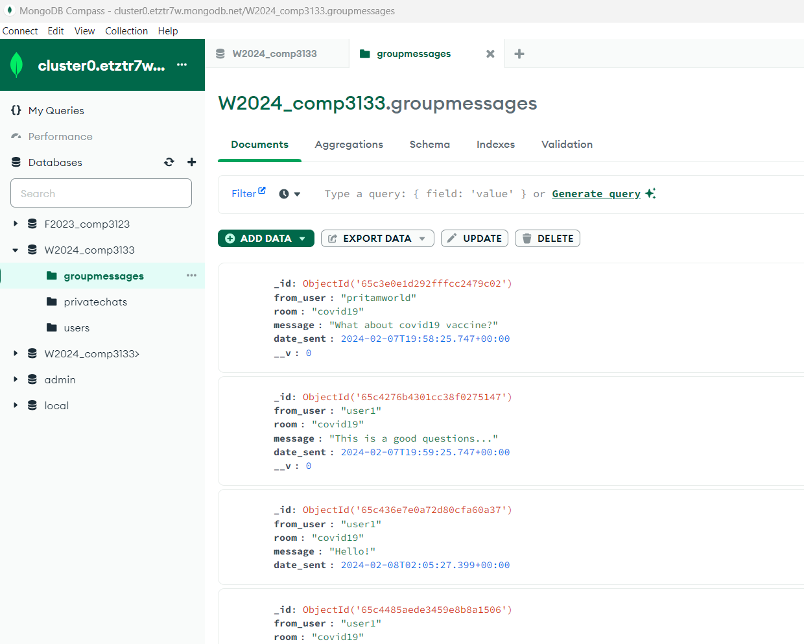

# 101395302_lab_test1_chat_app

## Features:
1. Login/ Logout
2. Register
3. Join/ Leave Group chat
4. Show Group chat history

## Sample screens:
1. Index page (Login page):

2. Register:

3. Landing page (Group chat page):
    - No chat group selected

4. Selected chat group (e.g. covid19):
    - Group Name, Group chat history is displayed

5. After send a message:

6. Leave Group:
    - Clear group name, group chat history in the chat panel

7. MongoDB collections - users:

8. MongoDB collections - groupmessages:

9. MongoDB collections – privatechats:

